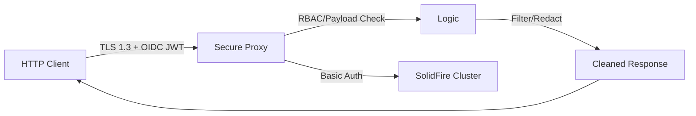

# Secure SolidFire API Proxy

This is a production-grade skeleton for a security-focused reverse proxy that sits in front of one or more NetApp SolidFire clusters. It provides advanced features that are typically unavailable in the standard SolidFire appliance.

## Features

- **Post-Quantum TLS:** Front-end encryption via TLS 1.3 with PQC hybrids (ML-KEM/Kyber).
- **OIDC-Ready Auth:** Designed to replace Basic Auth with JWT/OIDC validation.
- **Granular RBAC:** Prevent specific users from performing dangerous actions (e.g. non-admins cannot set manual QoS values).
- **Object Filtering (ABAC):** Automatically filter API responses to ensure users only see objects (Accounts, Volumes) belonging to them.
- **Auditable Logging:** Support for JSON-formatted logs and secure forwarding to a TLS-enabled Syslog destination.
- **Sensitive Data Redaction:** Leverages the `solidfire-go` SDK to (optionally, depending on application preference) automatically strip CHAP secrets from the `Account` object before it reaches the client.

## Architecture



## Configuration

The proxy uses the configuration structure defined in `config.go`. It maps Identity Provider (IdP) roles to SolidFire-specific permissions and tenant IDs.

## Usage

### 1. Build and Run
```bash
go build -o sf-proxy .
./sf-proxy -config config.yaml
```

### 2. Docker
To run with Docker, you should mount your configuration and certificates:
```bash
docker build -t solidfire-secure-proxy -f Dockerfile ../../
docker run -p 8443:8443 \
  -v $(pwd)/config.yaml:/etc/sf-proxy/config.yaml \
  -v $(pwd)/certs:/etc/sf-proxy/certs \
  solidfire-secure-proxy
```

## Security Note

This implementation is a **skeleton**. To use it in production, you must:
1. Replace the Mock Auth logic with a real OIDC library (e.g., `github.com/coreos/go-oidc`).
2. Provide valid TLS certificates for `server.ListenAndServeTLS`.
3. Complete the `ModifyResponse` logic to match your specific multi-tenancy requirements.
